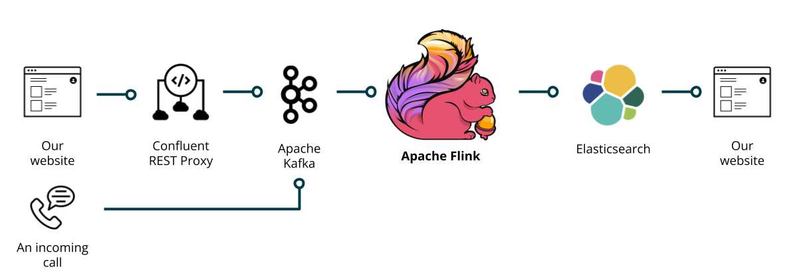
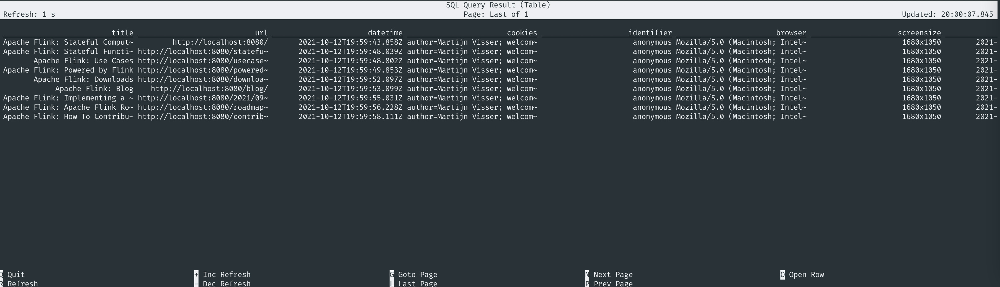

# Only SQL: Empower data analysts end-to-end with Flink SQL

This demo is used by Martijn Visser in his [Flink Forward talk 'Only SQL: Empower data analysts end-to-end with Flink SQL'](https://www.flink-forward.org/global-2021/conference-program#only-sql--empower-data-analysts-end-to-end-with-flink-sql)

## Docker

We'll use Docker Compose to start all necessary services to run the demos. It will start the following services:

* Apache Flink 1.13.2, accessible via http://localhost:8081
* Apache Flink SQL Client 1.13.2
* Apache Kafka (including Zookeeper) 6.2.0, accessible via broker:29092
* Confluent Schema Registry 6.2.0, accessible via http://localhost:8091 (or http://schema-registry:8091 via Docker networking) 
* Confluent REST Proxy 6.2.0, accessible via http://localhost:8082
* Elasticsearch 7.15.0, accessible via http://localhost:9200 (or http://elasticsearch:9200 via Docker networking)
* http-server: a simple static HTTP server, accessible via http://localhost:8080



## Starting the demo

```bash
# Start all services
docker-compose up -d

# Check if all the services are running
docker-compose ps

# Start the http-server
docker run -it --rm -p 8080:8080 -v $(pwd)/content:/public danjellz/http-server

# Star the Flink SQL Client
docker exec -it `docker ps -q --filter "ancestor=ftisiot/flink_sql_cli:1.13.2"` "./sql-client.sh"
```

## Explore all website behaviour

Any visit to one of the webpages is sent to the Kafka topic `pageview`. In order to explore them, we first need to register this Kafka topic as a TABLE. 

```sql
--Create table pageviews:
CREATE TABLE pageviews (
    `title` STRING,
    `url` STRING,
    `datetime` STRING,
    `cookies` STRING,
    `browser` STRING,
    `screensize` STRING,
    `ts` TIMESTAMP(3) METADATA FROM 'timestamp',
    WATERMARK FOR `ts` AS `ts` 
) WITH (
    'connector' = 'kafka',
    'topic' = 'pageview',
    'properties.bootstrap.servers' = 'broker:29092',
    'value.format' = 'avro-confluent',
    'value.avro-confluent.schema-registry.url' = 'http://schema-registry:8091'
);
```

Any cookie that belongs to our website, is also sent to the topic. We are specifically interested in a cookie called `identifier`. We're going to register a VIEW, which returns this value by applygin a regular expressing on the incoming data. 

```sql
--Create view which already extracts the identifier from the cookies
CREATE TEMPORARY VIEW web_activities AS 
    SELECT 
        `title`,
        `url`,
        `datetime`,
        `cookies`,
         REGEXP_EXTRACT(cookies, '(^| )identifier=([^;]+)', 2) as `identifier`,
        `browser`,
        `screensize`,
        `ts`
    FROM pageviews;
```

By now running queries on the view while visiting a webpage, you will see data appearing in the Flink SQL Client.

```sql 
SELECT * from web_activities;
```



```sql 
--Get the users who visit the homepage more than 3 times in 10 seconds
SELECT  
    `identifier`,
    CONCAT('You Have Seen The Homepage ', CAST(COUNT(*) as VARCHAR), ' Times')  
FROM web_activities
WHERE `url` = 'http://localhost:8080/' 
GROUP BY 
    TUMBLE(ts, INTERVAL '10' SECONDS), identifier
HAVING COUNT(*) > 3;
```

```sql
--Create a sink to display a notification
CREATE TABLE notifications (
    `identifier` STRING NOT NULL,
    `notification_id` STRING,
    `notification_text` STRING,
    `notification_link` STRING,
    PRIMARY KEY (identifier) NOT ENFORCED
) WITH (
    'connector' = 'elasticsearch-7',
    'hosts' = 'http://elasticsearch:9200',
    'index' = 'notifications'
);
```

```sql
INSERT INTO notifications (`identifier`, `notification_id`, `notification_text`)
    SELECT  
    `identifier`,
    'MyFirstNotification',
    CONCAT('You Have Seen The Homepage ', CAST(COUNT(*) as VARCHAR), ' Times')
FROM web_activities
    WHERE `url` = 'http://localhost:8080/'
GROUP BY
    TUMBLE(ts, INTERVAL '10' SECONDS), identifier
HAVING COUNT(*) > 3;
```

```sql
CREATE TABLE text_to_speech (
    `identifier` STRING,
    `results` STRING,
    `category` STRING,
    `ts` TIMESTAMP(3) METADATA FROM 'timestamp',
    WATERMARK FOR `ts` AS `ts`
) WITH (
    'connector' = 'kafka',
    'topic' = 'texttospeech',
    'properties.bootstrap.servers' = 'broker:29092',
    'value.format' = 'avro-confluent',
    'value.avro-confluent.schema-registry.url' = 'http://schema-registry:8091'
);
```

```sql
INSERT INTO notifications (`identifier`, `notification_id`, `notification_text`, `notification_link`)
SELECT  
    t.identifier,
    'MySecondNotification',
    'Here is how you can contribute',
    '/contributing/how-to-contribute.html'
FROM text_to_speech t, web_activities w
WHERE t.identifier = w.identifier
AND w.ts BETWEEN t.ts - INTERVAL '10' SECONDS AND t.ts
AND t.category = 'how-to-contribute';
```

### For debugging purposes

```bash
# List all Kafka topics
docker-compose exec broker kafka-topics \
--list \
--bootstrap-server broker:29092
```

```bash
# See data on topic:
docker-compose exec broker kafka-console-consumer \
--bootstrap-server broker:29092 \
--topic notifications \
--from-beginning
```