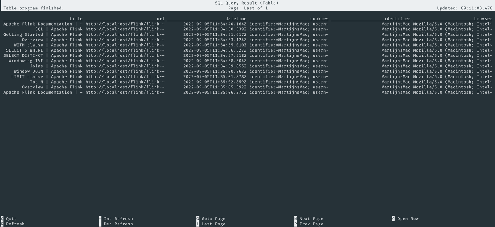

# Conference usage

This demo is used by Martijn Visser in the following conference talks:

* [Flink Forward talk 'Only SQL: Empower data analysts end-to-end with Flink SQL'](https://www.flink-forward.org/global-2021/conference-program#only-sql--empower-data-analysts-end-to-end-with-flink-sql) - [Recording](https://www.youtube.com/watch?v=KvaDe7QCwBQ) - [Demo version](https://github.com/MartijnVisser/flink-only-sql/releases/tag/v1.0) 
* [Uptime talk 'Only SQL'](https://uptime.aiven.io/session/325604) - [Demo version](https://github.com/MartijnVisser/flink-only-sql/releases/tag/v2.0)

[](https://twitter.com/MartijnVisser82) [](https://github.com/MartijnVisser)

## Docker

We'll use Docker Compose to start all necessary services to run the demos. It will start the following services:

* Apache Flink 1.15.1, accessible via http://localhost:8081
* Apache Flink SQL Client 1.15.1
* Apache Kafka (including Zookeeper) 7.2.1, accessible via broker:29092
* Confluent Schema Registry 7.2.1, accessible via http://localhost:8091 (or http://schema-registry:8091 via Docker networking) 
* Confluent REST Proxy 7.2.1, accessible via http://localhost:8082
* Elasticsearch 7.16.2, accessible via http://localhost:9200 (or http://elasticsearch:9200 via Docker networking)
* MySQL 8.0.30, accessible via JDBC at port 3306
* nginx 1.22.0 (stable): a powerfull HTTP server, accessible via http://localhost


## Starting the demo

```bash
# Build and start all services
docker-compose up --build -d

# Check if all the services are running
docker-compose ps

# Start the Flink SQL Client
docker-compose run sql-client
```

## Access the demo website

Visit http://localhost/flink/flink-docs-master/ to access the copy of the Apache Flink documentation, which is our demo 
website.

## Explore all realtime website behaviour

Any visit to one of the webpages is sent to the Kafka topic `pageview`. 
In order to explore them, we first need to register this Kafka topic as a table in Flink's catalog.

```sql
--Create table pageviews:
CREATE TABLE pageviews (
    `title` STRING,
    `url` STRING,
    `datetime` STRING,
    `cookies` STRING,
    `browser` STRING,
    `screensize` STRING,
    `ts` TIMESTAMP(3) METADATA FROM 'timestamp',
    `proc_time` AS PROCTIME(),
    WATERMARK FOR `ts` AS `ts` 
) WITH (
    'connector' = 'kafka',
    'topic' = 'pageview',
    'properties.bootstrap.servers' = 'broker:29092',
    'properties.group.id' = 'flink-only-sql',
    'scan.startup.mode' = 'latest-offset',
    'value.format' = 'avro-confluent',
    'value.avro-confluent.schema-registry.url' = 'http://schema-registry:8091'
);
```

Any cookie that belongs to the domain `localhost` (which is where our website runs), is also sent to the topic. 
You are specifically interested in a cookie called `identifier`. You're going to register a view, which returns this 
value by applying a regular expressing on the incoming data. 

```sql
--Create view which already extracts the identifier from the cookies
CREATE TEMPORARY VIEW web_activities AS 
    SELECT 
        `title`,
        `url`,
        `datetime`,
        `cookies`,
         REGEXP_EXTRACT(cookies, '(^| )identifier=([^;]+)', 2) as `identifier`,
        `browser`,
        `screensize`,
        `proc_time`,
        `ts`
    FROM pageviews;
```

By now running queries on the view while visiting a webpage, you will see data appearing in the Flink SQL Client.
This is an unbounded (streaming) source of data, meaning that the application will never end. 

```sql 
SELECT * from web_activities;
```


## Explore historical website behaviour

This demo setup has captured some historical website behaviour data. This has been stored in the MySQL table `history`.
In order to access this data, you first need to register this table in the Flink catalog. 

```sql
--Create table history:
CREATE TABLE history (
    `title` STRING,
    `url` STRING,
    `datetime` STRING,
    `cookies` STRING,
    `identifier` STRING,
    `browser` STRING,
    `screensize` STRING,
    `proc_time` STRING,
    `ts` TIMESTAMP(3),
    PRIMARY KEY (identifier) NOT ENFORCED
) WITH (
   'connector' = 'jdbc',
   'url' = 'jdbc:mysql://mysql:3306/sql-demo',
   'table-name' = 'history',
   'username' = 'flink-only-sql',
   'password' = 'demo-sql'
);
```

By now running a query on this data, you will see the historical data in the Flink SQL Client.
This is a bounded (batch) source of data, meaning that the application will end after processing all the data. 

```sql 
SELECT * from history;
```



## Determine users that are matching a certain pattern

You are going to use Flink's `MATCH_RECOGNIZE` function to select all identifiers that match a specific pattern. 
You can use this function for all sorts of Complex Event Processing capabilities.
In the setup below, you select all identifiers that visit:

1. http://localhost/flink/flink-docs-master/docs/try-flink/datastream/ followed by (both directly and indirectly)
2. http://localhost/flink/flink-docs-master/docs/try-flink/table_api/ followed by (both directly and indirectly)
3. http://localhost/flink/flink-docs-master/docs/try-flink/flink-operations-playground/

```sql
SELECT `identifier`
FROM web_activities
    MATCH_RECOGNIZE(
        PARTITION BY `identifier`
        ORDER BY `proc_time`
        MEASURES `url` AS url
        AFTER MATCH SKIP PAST LAST ROW
        PATTERN (A+ B+ C)
        DEFINE
            A AS A.url = 'http://localhost/flink/flink-docs-master/docs/try-flink/datastream/',
            B AS B.url = 'http://localhost/flink/flink-docs-master/docs/try-flink/table_api/',
            C AS C.url = 'http://localhost/flink/flink-docs-master/docs/try-flink/flink-operations-playground/'
);
```

## Act on the users that are matching the defined pattern

You've just created the list of `identifier` that meet our defined pattern. 
You now want to act on this data. 
In order to achieve that, you're going to send the list of `identifer` to your Elasticsearch sink. 
The website checks if there's any result in the Elasticsearch results and if so, it will display the notification. 

To send the data to Elasticsearch, you first have to create another table like you've done before in Flink's catalog.
Use the following DDL:

```sql
--Create a sink to display a notification
CREATE TABLE notifications (
    `identifier` STRING NOT NULL,
    `notification_id` STRING,
    `notification_text` STRING,
    `notification_link` STRING,
    PRIMARY KEY (identifier) NOT ENFORCED
) WITH (
    'connector' = 'elasticsearch-7',
    'hosts' = 'http://elasticsearch:9200',
    'index' = 'notifications'
);
```

When that table is created, you'll re-use the previous SQL that returns the list of `identifier` 
and send those results to the previously created table. 

```sql
INSERT INTO notifications (`identifier`, `notification_id`, `notification_text`)
    SELECT 
        T.identifier,
        'MyFirstNotification',
        'Are you trying to hack Flink?'
    FROM web_activities
    MATCH_RECOGNIZE(
        PARTITION BY `identifier`
        ORDER BY `proc_time`
        MEASURES `url` AS url
        AFTER MATCH SKIP PAST LAST ROW
        PATTERN (A+ B+ C)
        DEFINE
            A AS A.url = 'http://localhost/flink/flink-docs-master/docs/try-flink/datastream/',
            B AS B.url = 'http://localhost/flink/flink-docs-master/docs/try-flink/table_api/',
            C AS C.url = 'http://localhost/flink/flink-docs-master/docs/try-flink/flink-operations-playground/'
) AS T;
```

> :warning: The default value of the cookie `identifier` is `anonymous`. No notifications will be displayed if the value is `anonymous`. 
>
> In order to change the value, you need to open the Developer Tools via either Cmd + Opt + J (on Mac) or Ctrl + Shift + J (on Windows)
> 
> In the opened console, you then need to type `document.cookie="identifier=YourIdentifier"` to change the value of the `identifier` cookie. 

If you've changed the value of your `identifier` cookie, and you follow the defined pattern, 
a notification will be displayed to you. 


## Join and enrich streaming data with batch data

Another common use case in SQL is that you need join data from multiple sources. 
In the next example, you will display a notification to the user of the website 
who has visited the homepage more then 3 times in 10 seconds. If the `identifier` is `MartijnsMac`, the notification 
will display a link to the author's Twitter handle. The Twitter handle is retrieved from the external source. 
In case the identifier is different, no link will be included. 

The first thing that we'll do is create another table, so we can connect to the data. 

```sql
CREATE TABLE customer (
    `identifier` STRING,
    `fullname` STRING,
    `twitter_handle` STRING,
    PRIMARY KEY (identifier) NOT ENFORCED
) WITH (
   'connector' = 'jdbc',
   'url' = 'jdbc:mysql://mysql:3306/sql-demo',
   'table-name' = 'customer',
   'username' = 'flink-only-sql',
   'password' = 'demo-sql'
);
```

You can use a Window Table-Valued Function to determine which identifiers have visited the homepage more then 3 times.

```sql
SELECT window_start, window_end, window_time, COUNT(`identifier`) AS `NumberOfVisits` FROM TABLE(
   TUMBLE(TABLE web_activities, DESCRIPTOR(ts), INTERVAL '10' SECONDS))
   WHERE `url` = 'http://localhost/flink/flink-docs-master/'
   GROUP BY window_start, window_end, window_time
   HAVING COUNT(`identifier`) > 3;
```

The result of the Window Table-Valued Function can also be combined in a JOIN. You can join the previous results with 
the data in the previously registered `customer` table to enrich the result. You can use the following DDL for this:

```sql
SELECT w.identifier,
       COALESCE(c.fullname,'Anonymous') as `fullname`,
       COALESCE(c.twitter_handle,'https://www.google.com') as `twitter_handle`
FROM(
       SELECT `identifier`
       FROM TABLE(TUMBLE(TABLE `web_activities`, DESCRIPTOR(ts), INTERVAL '10' SECONDS))
       WHERE `url` = 'http://localhost/flink/flink-docs-master/'
       GROUP BY `identifier`
       HAVING COUNT(`identifier`) > 3 ) w
LEFT JOIN(
       SELECT *
       FROM customer ) c
ON w.identifier = c.identifier
GROUP BY w.identifier,
         c.fullname,
         c.twitter_handle;
```

With a slight modification to the DDL above, you can use the result for displaying an actionable insight to these
visitors:

```sql
INSERT INTO notifications (`identifier`, `notification_id`, `notification_text`, `notification_link`)
SELECT w.identifier,
       'MySecondNotification',
       CONCAT('Welcome ', COALESCE(c.fullname,'Anonymous')),
       COALESCE(c.twitter_handle,'https://www.google.com')
FROM(
       SELECT `identifier`
       FROM TABLE(TUMBLE(TABLE `web_activities`, DESCRIPTOR(ts), INTERVAL '10' SECONDS))
       WHERE `url` = 'http://localhost/flink/flink-docs-master/'
       GROUP BY `identifier`
       HAVING COUNT(`identifier`) > 3 ) w
LEFT JOIN(
       SELECT *
       FROM customer ) c
ON w.identifier = c.identifier
GROUP BY w.identifier,
         c.fullname,
         c.twitter_handle;
```


